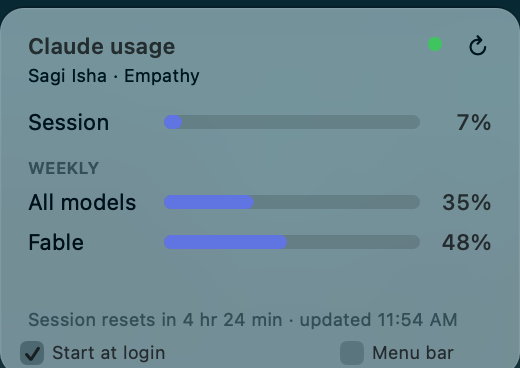
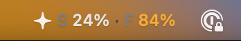

# Claude Usage Widget

A small always-on-top floating widget for macOS showing your Claude Code usage
limits — current session, all-models weekly, and Fable weekly — the same data
as [claude.ai/settings/usage](https://claude.ai/settings/usage).

Native Swift/AppKit, no dependencies.



Or tuck it into the menu bar instead:



## Quick setup

1. **Prereqs**: Xcode Command Line Tools (`xcode-select --install`) and a
   Claude Code sign-in (run `claude` once and log in, if you haven't).
2. **Clone**:
   ```sh
   git clone git@github.com:empathycom/claude-usage-widget.git
   cd claude-usage-widget
   ```
3. **Build and run**:
   ```sh
   ./start
   ```
   macOS will ask to allow Keychain access to your Claude Code credentials —
   click **Always Allow**. The widget appears in the top-right corner; drag it
   wherever you like.
4. **(Optional) Start at login**: tick the **Start at login** checkbox at the
   bottom of the widget. It writes a LaunchAgent
   (`~/Library/LaunchAgents/com.empathy.claude-usage-widget.plist`) pointing at
   the binary's current location; untick to remove it. Takes effect at next
   login — don't move the binary afterwards, or re-tick the box if you do.

## How it works

Reads your Claude Code OAuth token from the macOS Keychain (item
`Claude Code-credentials`, falling back to `~/.claude/.credentials.json`) and
polls `https://api.anthropic.com/api/oauth/usage` every 5 minutes — slow on
purpose, so the widget never trips the API's rate limit. Your name and org come
from `/api/oauth/profile`. When the token expires, the widget renews it with
the same OAuth refresh grant Claude Code uses and stores the result back, so
it keeps working (and keeps Claude Code signed in) even if you haven't opened
Claude Code in a while. Tokens never leave your machine except to Anthropic's
API and OAuth endpoints.

## Build & run

`./start` compiles the source when it changed, stops a widget that's already
running, and launches a fresh one in the background:

```sh
./start          # build if needed, then run
./start --force  # always rebuild
./start --stop   # stop the running widget
```

On first run, macOS asks to allow Keychain access — choose **Always Allow**.

## Usage

- Drag anywhere; position is remembered. Visible on all Spaces, no Dock icon.
- Pulsing dot: green = up to date, yellow = temporary hiccup (it retries on its
  own), red = you need to sign in again. Hover it for the detail and the time of
  the last update — the widget never covers the panel with error text, it just
  keeps showing the last numbers it got.
- ↻ or right-click → **Refresh now**; right-click → **Quit** to close.
- Bars turn orange at 70% and red at 90%. Hover a row for the exact reset time.
- Floater in the way? Tick **Menu bar** (bottom-right) to tuck the widget into
  the menu bar: it shows your session and Fable percentages (`S 42% · F 9%`)
  next to your other status icons, click it to drop the full panel down,
  right-click for Refresh / move back / Quit. Untick (or right-click → **Move
  back to floating widget**) to float again at the remembered spot.

## Debugging

`swift debug-usage.swift` and `swift debug-profile.swift` print the raw API
responses if the format ever changes.
